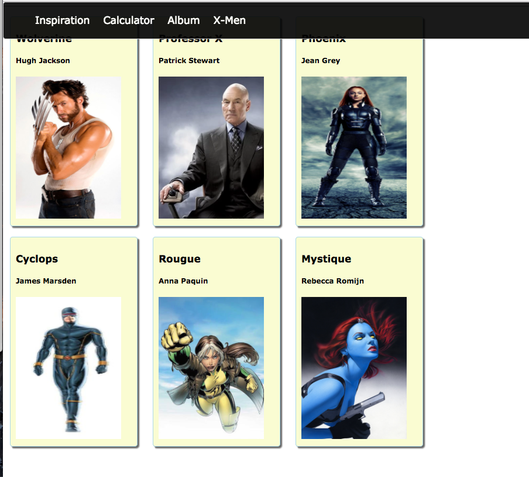
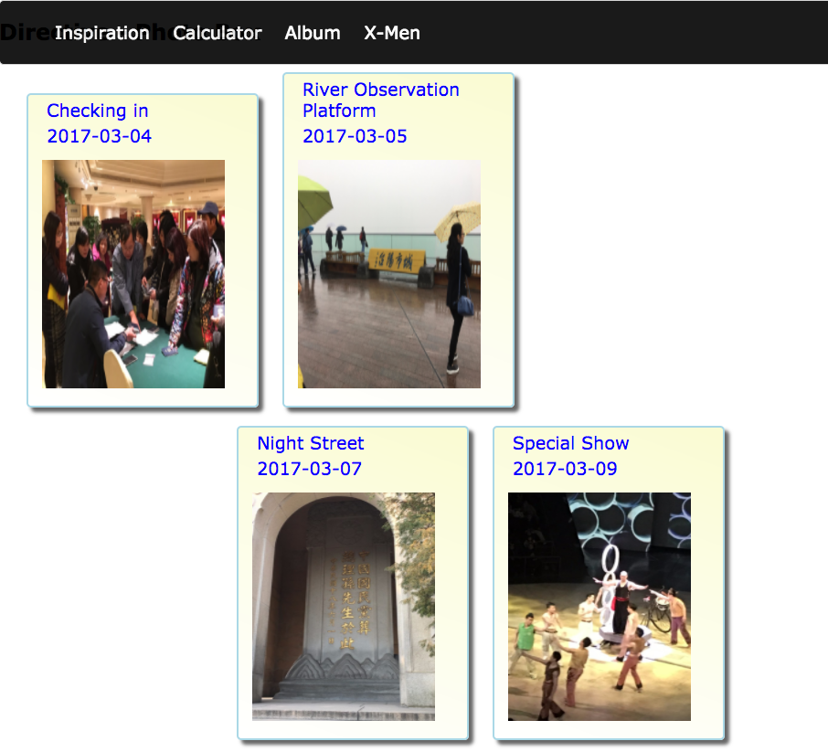
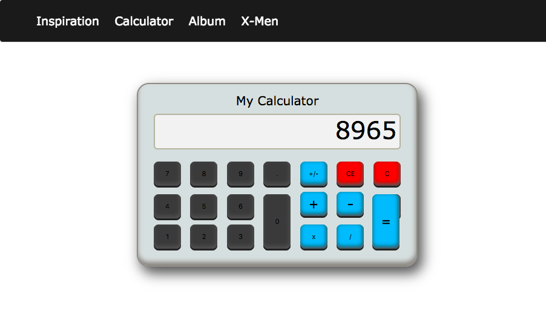
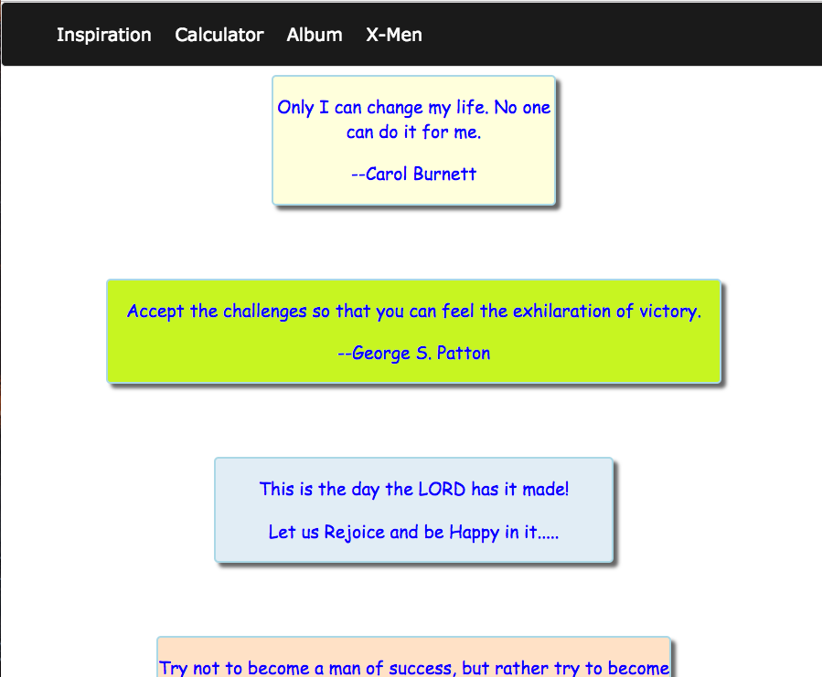

# my-showcase-A1

This project was created to 
    (1) Organize collection of small AngularJS (A1) projects into one app for showcasing.
    (2) With the help of a special pane, user can view code associated with each project to quickly copy code.
A separate app will be created for Angular (A4) projects.


## Links
[Live demo](https://my-showcase-a1.herokuapp.com)

[This Repository](https://github.com/shorebird2016/my-showcase-A1)

    
## Screen shots
    
    
    
    


## Dev Log

2017-08-24
  - Started with the app with 4 directives ()
  - Remove .DS_Store .idea to .gitignore


## Dev Notes

(1) Remove tracked git files, also add it to .gitignore 
``` git rm -rf --cached <FOLDER>```
(2) Webstorm has support for .gitignore syntax
(3) Webstorm markdown does not like image name with space in it (eg. album tab.png won't work)

